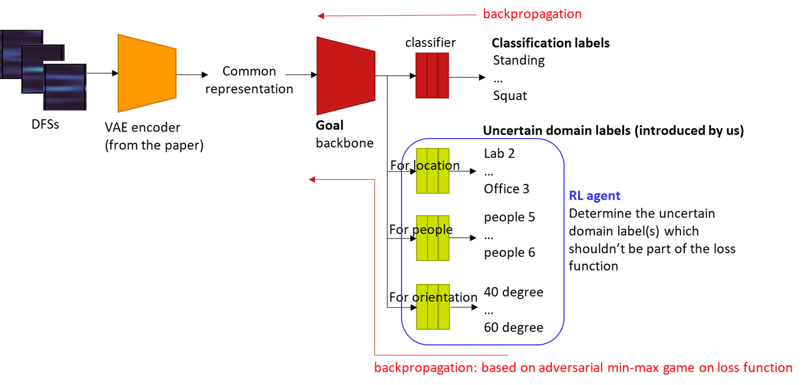

# BEP_codes
Domain adaption in activity recognition using WiFi-CSI data with reinforcement learning in an adversarial setting 
The model has the framework below.
For now I want to implement the model for only one domain class. The RL agent has many components missing, questions regarding this are commented out in the python files. Thank you!

